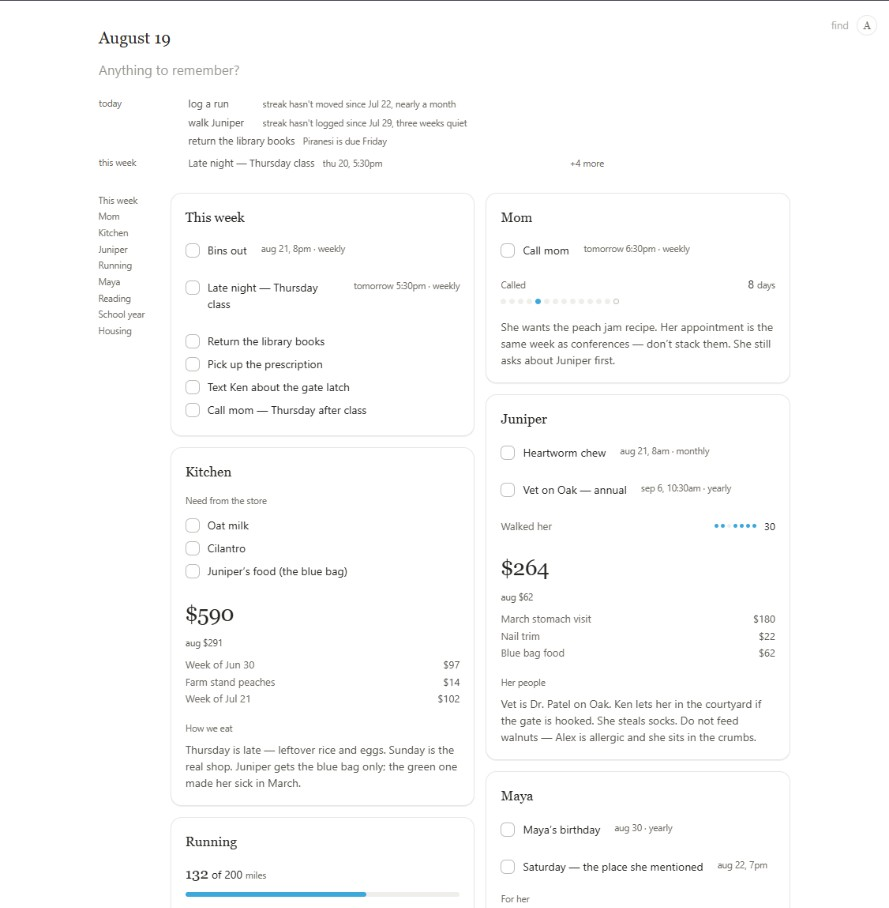

<p align="center"></p>

# December

> [!IMPORTANT]
> **December is currently in beta.** Expect frequent improvements while the
> installer, automatic updates, and cross-device experience are finalized.
> Keep a separate backup of your December data before upgrading.

**Fastest setup:** give a local AI assistant with terminal access the
[December installation instructions](https://github.com/Patchnet/december-app#install-december)
and ask it to install December for you.

December is a local-first page that turns ordinary sentences into an organized
view of your year. Capture first. December files the details with Claude Code
or Codex, while your page and history stay on your computer.

<p align="center"></p>

## Install December

Choose the option that fits your computer:

| Option | Best for | What you need |
| --- | --- | --- |
| [Ask your AI](#ask-your-ai-to-install-december) | The easiest guided setup | A local AI assistant with terminal access |
| [Windows installer](#windows-installer) | The easiest Windows setup | 64-bit Windows |
| [Desktop app from source](#desktop-app-from-source) | macOS or local development | Node.js 22.13+, npm, and Git |
| [Local browser server](#local-browser-server) | Windows, macOS, or Linux without the desktop shell | Node.js 22.13+ and Git |

### Ask your AI to install December

The easiest setup is to let a local AI assistant inspect your computer and
follow the correct path below. Send the assistant this link:

<https://github.com/Patchnet/december-app#install-december>

Then send this request:

```text
Install December from https://github.com/Patchnet/december-app.

Read the complete "Install December" and "How AI works in December" sections
before making changes. Choose the supported installation for this operating
system. Preserve any existing December installation and data; never delete or
overwrite them. Ask before installing system prerequisites, opening a graphical
installer, proceeding past an operating-system security warning, or changing
AI and assistant configuration.

After installation, verify that December opens. Tell me where it was installed,
where its data will be stored, how to start and stop it, and whether Claude Code
or Codex CLI was detected as its organizing engine.
```

Claude Code, Codex CLI, Cursor, and other local coding assistants can usually do
this because they can run terminal commands and inspect files. Claude Desktop,
ChatGPT, or another chat-only app can install December only when it has been
given a tool that can control your computer or terminal.

<details>
<summary><strong>Instructions for the installing AI</strong></summary>

#### Installation checklist

1. Check the operating system and architecture. Check for an existing December
   installation, repository, and data directory before writing anything.
2. On 64-bit Windows, prefer the official setup file from the repository's
   Releases page when one exists. Do not download an installer from another
   source and do not bypass a security warning without the user's approval.
3. If no Windows setup file exists, or when installing on macOS, use the
   desktop-from-source instructions below. Require Node.js 22.13 or newer and
   Git; ask before installing either prerequisite.
4. Use `npm ci`, not `npm install`, for a source desktop installation. Run
   `npm test` and stop if the gate fails. Then start the app with `npm run app`.
5. Use `node server.mjs` only when the user chooses the browser-server option.
6. Never delete or replace a December data directory. Do not connect assistants
   or install an AI organizing engine without the user's approval.
7. Finish by reporting the installation path, data location, start/stop steps,
   test result, and detected organizing-engine status.

</details>

### Windows installer

You do not need Node.js, npm, Git, or a developer setup.

1. Open [December Releases](https://github.com/Patchnet/december-app/releases).
2. Open the newest release and download
   `December-Setup-<version>-x64.exe`.
3. Run the downloaded installer and follow the setup steps.
4. Open **December** from the Start menu or desktop shortcut.

If the Releases page does not list a setup file, a public Windows installer
has not been published yet. Use one of the source options below instead.

The installer is not code-signed yet, so Windows may show a SmartScreen
warning. Confirm that the file came from the `Patchnet/december-app` Releases
page before you continue.

To update a supported installation, return to the Releases page and install the
newer version over the current one. Your page remains in your Windows user
profile. In-app automatic updating is under development and is not part of the
supported installation flow until its packaged acceptance test passes.

### Desktop app from source

There is no downloadable macOS app yet. Mac users can run the desktop app from
source. These steps also work for contributors on Windows.

Install these tools first:

- [Node.js](https://nodejs.org) 22.13 or newer. npm is included with Node.js.
- [Git](https://git-scm.com/downloads).

Then open Terminal on macOS, or PowerShell on Windows:

```bash
git clone https://github.com/Patchnet/december-app.git
cd december-app
npm ci
npm run app
```

Keep that process running while you use December. Closing the window hides the
app; quit from the tray on Windows or the menu bar on macOS. The global capture
shortcut is `Ctrl+Alt+D` on Windows and `Command+Option+D` on macOS.

### Local browser server

Use this option if you want the page without the desktop window, tray menu,
global shortcut, or automatic updates. It runs on Windows, macOS, and Linux.

Install [Node.js](https://nodejs.org) 22.13 or newer and
[Git](https://git-scm.com/downloads), then run:

```bash
git clone https://github.com/Patchnet/december-app.git
cd december-app
node server.mjs
```

Open [http://localhost:3008](http://localhost:3008). This option does not need
`npm install` or `npm ci` because the page server has no runtime dependencies.
Keep the terminal process running while December is open.

### How AI works in December

December is the page, the interface, and the local data store. It does not
include an AI model. For automatic organization, it uses either **Claude Code**
or **Codex CLI** as its organizing engine.

CLI means *command-line interface*. In this case, it is a small AI program
installed on your computer and signed in to its provider. December runs that
program behind the scenes; you do not need to type a command every time you add
something.

When you capture a sentence, December:

1. Saves the original sentence immediately.
2. Gives the selected organizing engine the capture and the relevant page
   context.
3. Lets the engine decide whether the information belongs in a list, reminder,
   tracker, ledger, streak, note, goal, or another existing part of the page.
4. Applies the result through December's limited tools and validation, then
   saves the updated page locally.

December does not directly give the AI permission to edit its data files. The
engine works through December's own tools, and December remains responsible for
validating and saving every change.

#### What you need to install

Choose and sign in to one of these tools:

- [Claude Code](https://claude.com/claude-code), Anthropic's command-line AI
  tool. After installation, `claude --version` should work in a terminal.
- [Codex CLI](https://developers.openai.com/codex/cli/), OpenAI's command-line
  AI tool. After installation, `codex --version` should work in a terminal.

The December installer does not install either AI tool for you. After installing
one, restart December. First-run setup detects the available tools and asks
which one should organize your captures.

December does not require a separate December API key or AI subscription. The
selected CLI must have working access through its provider account, and that
provider's plan, usage rules, and data terms still apply. Capture and page
content given to the CLI may be processed by Anthropic or OpenAI just as it is
when you use that CLI directly; December does not send it to a separate
December-hosted AI service.

If neither tool is available, December starts in **capture-only mode**. Every
line is still saved, but it waits to be organized until an engine is installed
and signed in.

This organizing engine is different from an optional assistant connection.
The engine files new captures automatically. **Settings → Connections** lets
Claude Code, Claude Desktop, Codex, or Cursor read and update the page when you
ask them to.

## Pocket

Pocket puts the same page on your phone. The desktop remains the writer, and
the relay cannot read the encrypted page or capture contents.

Open **Settings → Pocket → Connect phone** on the computer. On the phone, open
[app.getdecember.me](https://app.getdecember.me) and scan the code.

Pocket needs an internet connection to synchronize. The desktop page remains
local-first and continues working if the relay is temporarily unavailable.

## Why December

Most people are not disorganized. They are carrying too much.

The rent. A shift on Thursday. The miles you meant to run. An appointment you
will have forgotten by Friday. None of it is difficult on its own. Together it
is a second job, and it is worked in your head, at night, for free.

Every tool built to hold this asks you to do that job first. Pick a project,
name a list, choose a template, decide where the thing belongs before you are
allowed to write it down.

December asks for a sentence.

You write one line, the way you would say it out loud. It is saved the moment
you type it. Then it is put where it belongs.

```
you write

  paid rent 2300 and ran 4 miles before work

and a moment later

  Rent                        Running
  8 of 12 payments            412 of 600 miles
  ● ● ● ● ● ● ● ● ○ ○ ○ ○     ▔▔▔▔▔▔▔▔▔▔▔▔▔▔▔░░░░░░
  $18,400 paid                ran today · 118 days
```

You did not pick a card type or set up a chart. There is nothing to learn.

December keeps important information visible instead of burying it in a chat
thread. The page covers one year, so you reach December with a record of what
you did, the goals you reached, and the milestones along the way.

Use it as you wish and tell us how to make it better. The software is licensed
under the [Apache License 2.0](LICENSE). December, its name, logo, and related
marks are trademarks of [Patchnet AI](https://github.com/Patchnet); the software
license does not grant trademark rights. See [TRADEMARKS.md](TRADEMARKS.md).

## Your data

There is no December account. Your page is stored in files on your computer:

```
data/state.json            the page
data/events-<year>.jsonl   every change, in order
data/years/<year>.json     past years, kept whole
data/backups/              a snapshot a day, thirty kept
```

The desktop app stores this directory in your operating system's user profile.
The local browser server stores it in the cloned repository unless you set
`DECEMBER_DATA_DIR`.

Writes are atomic. If the page becomes unreadable, December restores the newest
good copy. If no copy can be read, it refuses to start instead of showing an
empty page over a full one.

## Connect an assistant

December exposes the same page through the Model Context Protocol (MCP), so an
assistant can read and update it directly. Start December, then run:

```bash
node connect.mjs
```

The connection wizard finds Claude Code, Claude Desktop, Codex, and Cursor. It
connects the clients you choose and verifies the result. Use
`node connect.mjs --yes` to connect every detected client, or use
**Settings → Connections** in the app.

December must be running while an assistant uses the connection. The desktop
app uses `http://localhost:3008`, with `:3009` as a fallback. Set
`DECEMBER_URL` to use another local address.

## Develop and test

Install the pinned dependencies and run the complete lint and test gate:

```bash
npm ci
npm test
```

`npm run test:node` runs only the built-in Node test suite. It is not the
complete gate. Build an unsigned Windows installer locally with:

```bash
npm run dist:win
```

ESLint, Electron, and packaging tools are development dependencies. The
packaged Windows app includes `electron-updater`; the standalone page server
still has no runtime dependencies.
